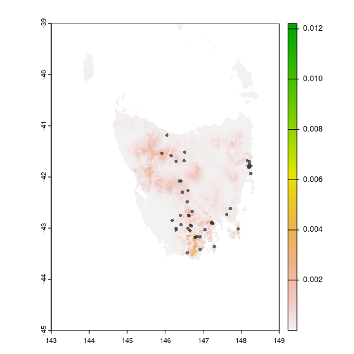

<!-- badges: start -->

[](https://github.com/skiptoniam/ppmData/actions)
[](https://codecov.io/github/skiptoniam/ppmData?branch=master)
<!-- badges: end -->

## ppmData is an R package that can be used to set up a quadrature scheme for spatial point processes modelling and could be used in other packages, like [ecomix](https://github.com/skiptoniam/ecomix) to run marked poisson point processes.

## Summary

The approach uses quasi-random sampling (Grafston & Tille, 2013, Foster
et al., 2018) to generate a quadrature scheme for numerical
approximation of a Poisson point process model (Berman & Turner 1992;
Warton & Shepard 2010). Quasi-random sampling quadrature are a form of
spatially-balanced survey design or point stratification that aims to
reduce the frequency of placing samples close to each other (relative to
pseudo-random or grid designs). A quasi-random quadrature design
improves efficiency of background point sampling (and subsequent
modelling) by reducing the amount of spatial auto-correlation between
data implying that each sample is providing as much unique information
as possible (Grafston & Tille, 2013, Foster et al., 2018) and thus
reducing low errors for geostatistical prediction (Diggle & Ribeiro,
2007). Because the quasi-random design is not on a regular grid we use
Dirichlet tessellation to generate polygons for each point in the
quadrature scheme. Areal weights are then derived from these polygons.

We note that this approach is different to a targeted background scheme
for generating pseudo-absences. If the users intent is to reduce
sighting biases via a targeted background scheme, we recommend that bias
is accounted for via covariates (distance to roads) or an offset (a
known amount of effort) (e.g Warton et al., 2013; Renner et al, 2015).

## Using the ppmData package

### Installation

The `ppmData` package can be installed using `devtools` or `remotes` R
packages.

``` r
install.packages('devtools')
devtools::install_github('skiptoniam/ppmData')
```

### Example

Here is an example using a dataset from the `ppmData` package. We setup
a quadrature scheme for the species *Tasmaphena sinclairi* located
within Tasmania, Australia.

``` r
library(ppmData)
path <- system.file("extdata", package = "ppmData")
lst <- list.files(path=path, pattern='*.tif',full.names = TRUE)
covariates <- rast(lst)
presences <- subset(snails,SpeciesID %in% "Tasmaphena sinclairi")
npoints <- 1000
ppmdata1 <- ppmData(npoints = npoints, presences=presences,
                    window = covariates[[1]], covariates=covariates)
```

Here we plot the quadrature scheme. The green points represent the known
locations of *Tasmaphena sinclairi*. The black points represent the
quadrature locations. Quasi-random quadrature where the integration
points are generated using a quasi-random areal sample.

``` r
plot(ppmdata1)
```


Once the `ppmData` object has been set up it is quiet easy to fit a
point process model in R. You can use something like `glm`, `gam` or
even convert the `ppmData` object to work directly with `spatstat::ppm`.
Here is a brief example of how you might fit a ppm using `glm`:

``` r
ppp <- ppmdata1$ppmData
form  <- presence/weights ~ poly(annual_mean_precip, degree = 2) + 
                            poly(annual_mean_temp, degree = 2) + 
                            poly(distance_from_main_roads, degree = 2)

ft.ppm <- glm(formula = form, data = ppp,
              weights = as.numeric(ppp$weights),
              family = poisson())
```

One we have fitted the model, we might want to predict the relative
intensity across the window, this will give us something similar to the
expected count of species presences per-cell.

``` r
pred <- predict(covariates,
                ft.ppm,
                type="response")
plot(pred*prod(res(pred))) # scale response by area of cell.
points(presences[!duplicated(presences),1:2],pch=16,cex=0.75,col=gray(0.2,0.75))
```

<!-- -->

## Code of Conduct

Please note that the ppmData project is released with a [Contributor
Code of
Conduct](https://contributor-covenant.org/version/2/0/CODE_OF_CONDUCT.html).
By contributing to this project, you agree to abide by its terms.

## References

Diggle, P. J., P. J. Ribeiro, *Model-based Geostatistics*. Springer
Series in Statistics. Springer, 2007.

Foster, S.D., Monk, J., Lawrence, E., Hayes, K.R., Hosack, G.R. and
Przeslawski, R., 2018. *Statistical considerations for monitoring and
sampling.* Field manuals for marine sampling to monitor Australian
waters, pp.23-41.

Grafstrom, Anton, and Yves Tille. *Doubly balanced spatial sampling with
spreading and restitution of auxiliary totals.* Environmetrics 24.2
(2013): 120-131.

Renner, I.W., Elith, J., Baddeley, A., Fithian, W., Hastie, T.,
Phillips, S.J., Popovic, G. and Warton, D.I., 2015. *Point process
models for presence only analysis.* Methods in Ecology and Evolution,
6(4), p.366-379.

Warton, D. I., and L. C. Shepherd. *Poisson point process models solve
the pseudo-absence problem for presence-only data in ecology.* The
Annals of Applied Statistics 4.3 (2010): 1383-1402.

Warton, D.I., Renner, I.W. and Ramp, D., 2013. *Model-based control of
observer bias for the analysis of presence-only data in ecology.* PloS
one, 8(11), p.e79168.
